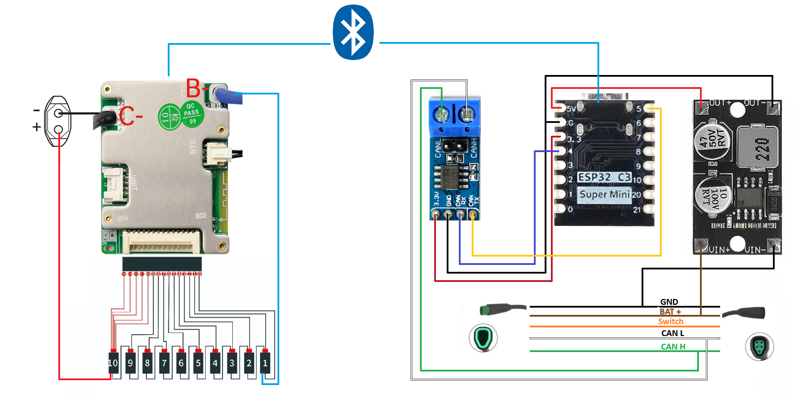
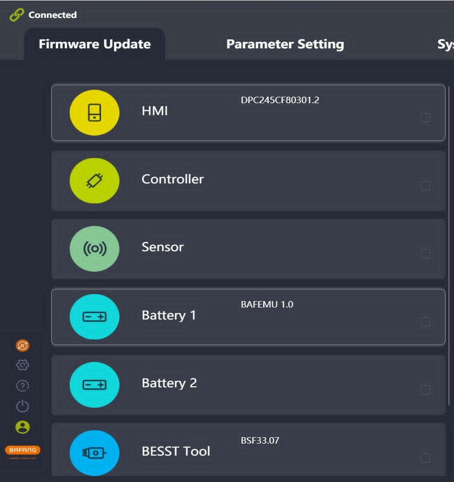
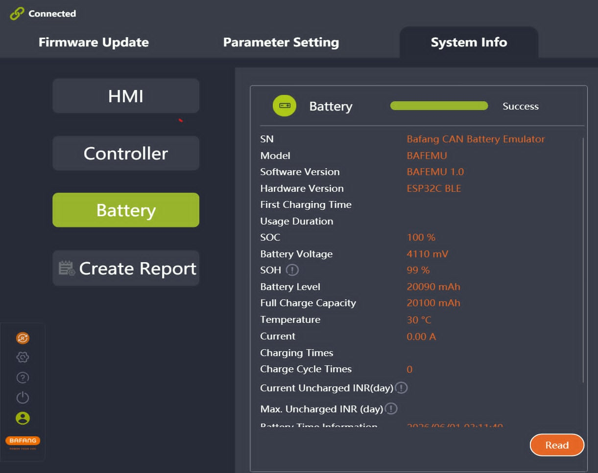
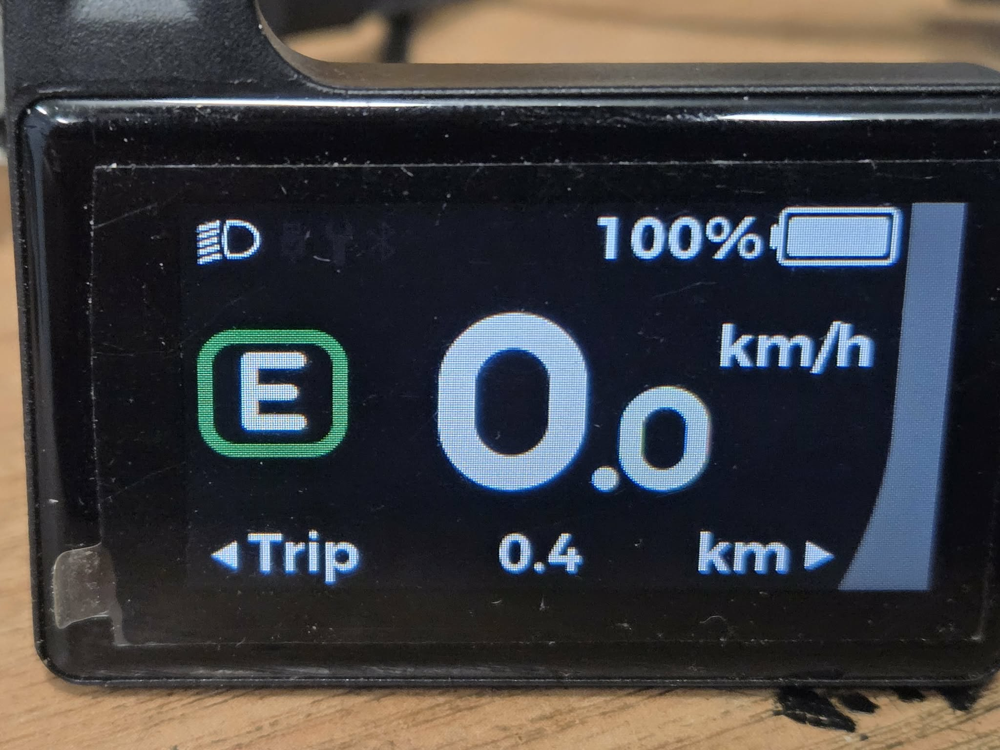
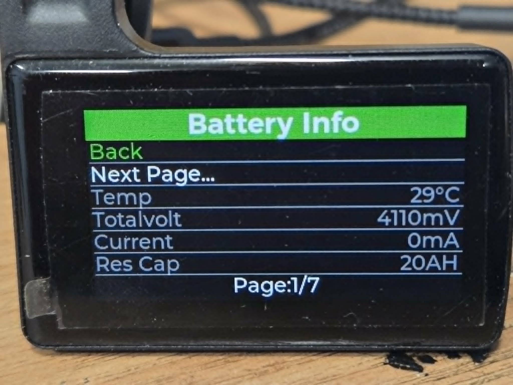
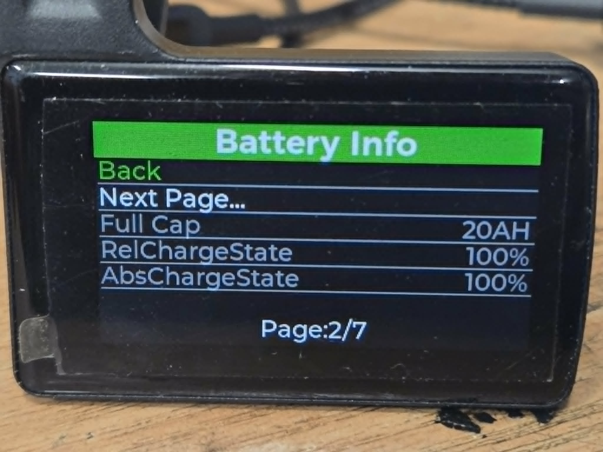
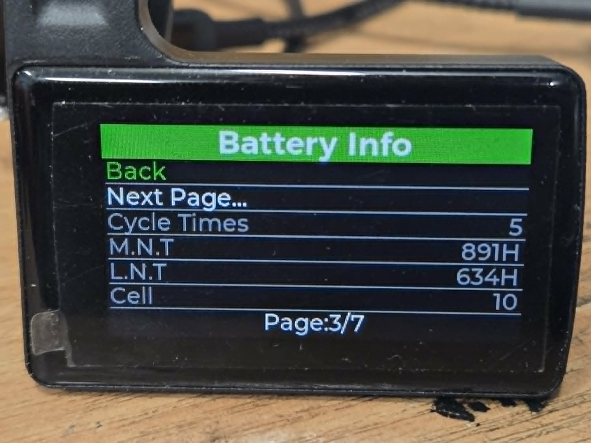
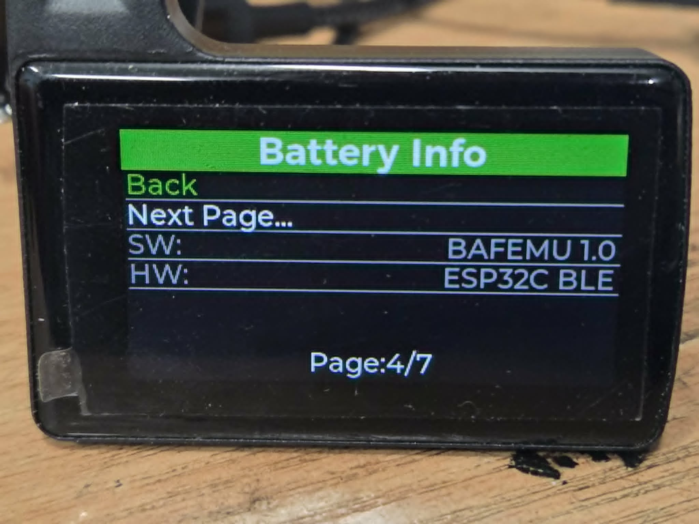
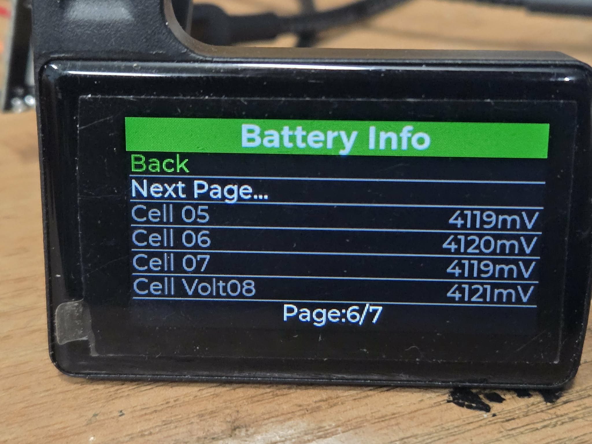
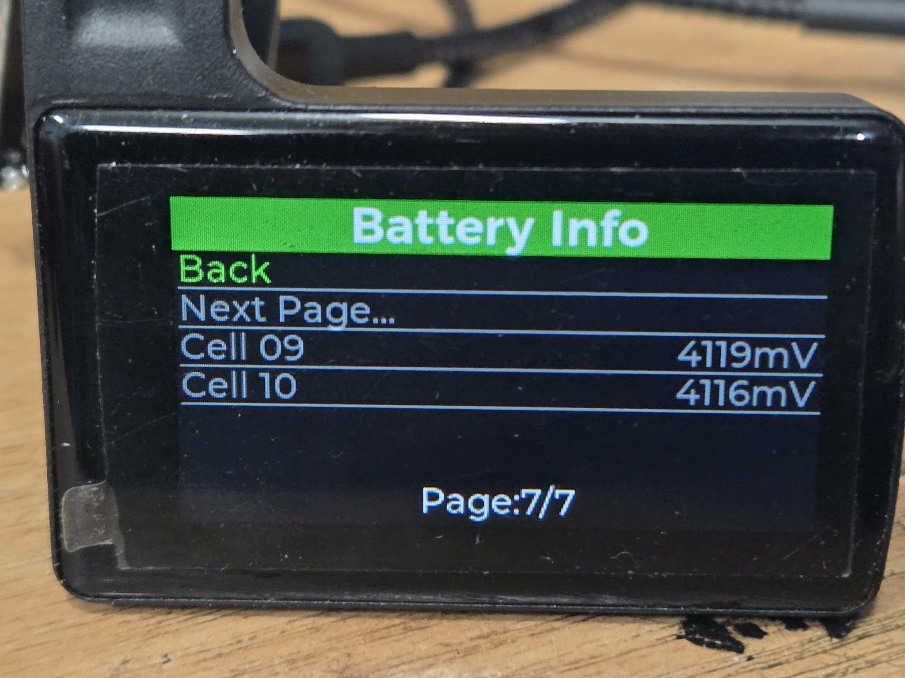

# Bafang CAN Battery Emulator

ESP32-based battery emulator for Bafang CAN systems using a JBD Smart BMS connected via Bluetooth Low Energy (BLE).

The firmware reads battery information from a JBD BMS and translates it into CAN messages expected by Bafang CAN controllers and displays. This allows a custom battery pack to behave like an original Bafang CAN battery.

---

## Hardware Overview

<p align="center">
  
</p>

### Main Components

* ESP32-C3 Super Mini
* SN65HVD230 CAN Transceiver
* JBD Smart BMS with BLE support
* DC/DC Buck Converter, suitable for battery voltage
* Bafang CAN Controller / Display

---

## System Architecture

```text
JBD Smart BMS
      │
      │ BLE
      ▼
ESP32-C3
      │
      │ CAN (250 kbps)
      ▼
SN65HVD230
      │
      ▼
Bafang Controller / Display
```

The ESP32 acts as a gateway between the Bluetooth-enabled BMS and the Bafang CAN bus.
The emulator can be connected directly to the Bafang BESST diagnostic tool.
With the emulator connected, the BESST software detects a valid battery and allows reading battery-related information without a physical Bafang battery.
<p align="center">
  
</p>
<p align="center">
  
</p>

Battery information shown on a Bafang DP C245 display when connected through the emulator.
<p align="center">
  
</p>
<p align="center">
  
</p>
<p align="center">
  
</p>
<p align="center">
  
</p>
<p align="center">
  
</p>
<p align="center">
  
</p>
<p align="center">
  
</p>
<p align="center">
  
</p>

---

## Features

* BLE communication with JBD Smart BMS
* Automatic BLE reconnection
* CAN communication at 250 kbps
* Bafang battery protocol emulation
* Multi-frame CAN message support
* Single-frame CAN message support
* Real-time battery monitoring
* Cell voltage reporting
* SOC reporting
* SOH estimation
* Temperature reporting
* Compatible with ESP32-C3

---

## Supported BMS Data

The following parameters are read directly from the JBD BMS:

* Battery voltage
* Battery current
* State of Charge (SOC)
* Remaining capacity
* Rated capacity
* Cycle count
* Protection status
* Cell voltages
* Temperature sensor #1
* Temperature sensor #2

---

## Wiring

### ESP32 ↔ CAN Transceiver

| ESP32 | SN65HVD230 |
| ----- | ---------- |
| GPIO5 | TXD        |
| GPIO4 | RXD        |
| 3.3V  | VCC        |
| GND   | GND        |

### CAN Bus

| SN65HVD230 | Bafang CAN |
| ---------- | ---------- |
| CANH       | CAN H      |
| CANL       | CAN L      |
| GND        | GND        |

### Power Supply

The ESP32 and CAN transceiver are powered through a DC/DC buck converter connected directly to the battery pack.

Recommended output voltage:

* 5V to ESP32 VIN

---

## BLE Configuration

Set the BLE MAC address of your JBD BMS:

```cpp
#define BMS_MAC "A5:C2:39:31:67:61"
```

### Service UUID

```text
0000FF00-0000-1000-8000-00805F9B34FB
```

### RX Characteristic

```text
0000FF02-0000-1000-8000-00805F9B34FB
```

### TX Characteristic

```text
0000FF01-0000-1000-8000-00805F9B34FB
```

---

## CAN Bus Configuration

### Speed

```text
250 kbps
```

### CAN Transceiver

```text
SN65HVD230
```

### Extended CAN IDs

All frames use 29-bit extended identifiers.

---

## Periodic CAN Broadcasts

### Current / Voltage / Temperature

| CAN ID     |
| ---------- |
| 0x04F83401 |

Transmission interval:

```text
100 ms
```

Contents:

* Current
* Voltage
* Temperature

---

### Capacity / SOC / SOH

| CAN ID     |
| ---------- |
| 0x04F83400 |

Transmission interval:

```text
200 ms
```

Contents:

* Full capacity
* Remaining capacity
* SOC
* SOH

---

### Heartbeat

| CAN ID     |
| ---------- |
| 0x04F83402 |

Transmission interval:

```text
500 ms
```

---

### Timestamp

| CAN ID     |
| ---------- |
| 0x04F83403 |

Transmission interval:

```text
1000 ms
```

---

## Supported Bafang Requests

### Multi-frame Commands

| Command |
| ------- |
| 0x6000  |
| 0x6001  |
| 0x6002  |
| 0x6003  |

Implemented with full ACK handling and timeout recovery.

---

### Single-frame Commands

| Command |
| ------- |
| 0x6400  |
| 0x6401  |
| 0x6402  |
| 0x6403  |
| 0x6404  |
| 0x6405  |

---

## Data Mapping

| JBD BMS            | Bafang CAN              |
| ------------------ | ----------------------- |
| Voltage            | Pack Voltage            |
| Current            | Battery Current         |
| SOC                | State Of Charge         |
| Rated Capacity     | Full Capacity           |
| Remaining Capacity | Remaining Capacity      |
| Cell Voltages      | Cell Information Frames |
| Temperature        | Battery Temperature     |
| Cycle Count        | Battery Statistics      |

---

## State Of Health (SOH)

SOH is estimated using:

```text
SOH = FCC / Design Capacity × 100
```

Where:

* FCC = estimated Full Charge Capacity
* Design Capacity = rated capacity reported by the BMS

---

## Build Environment

Developed using:

* Arduino Framework
* ESP32 Arduino Core
* NimBLE-Arduino
* ESP-IDF TWAI Driver

---

## Tested Hardware

### BMS

* JBD Smart BMS
* 10S configuration

### MCU

* ESP32-C3 Super Mini

### CAN

* SN65HVD230

### Drive System

* Bafang CAN Bus Systems

---

## Notes

This project is intended for custom battery packs used with Bafang CAN-based e-bike systems.

The firmware emulates the battery communication protocol expected by the controller and display while using battery data provided by a JBD Smart BMS over BLE.

---

## License

MIT License
